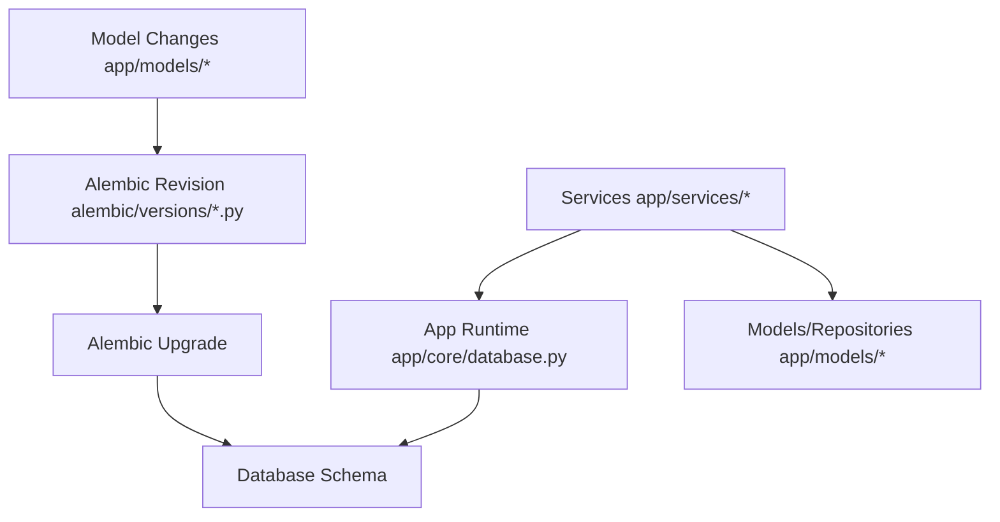
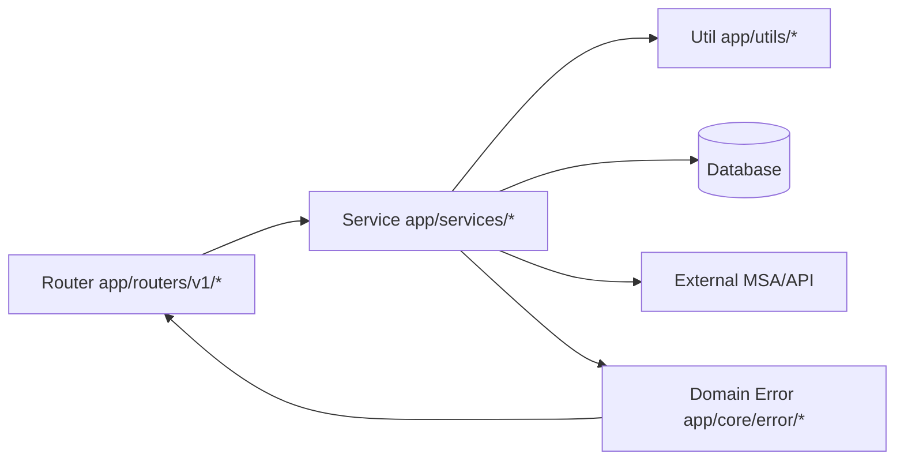
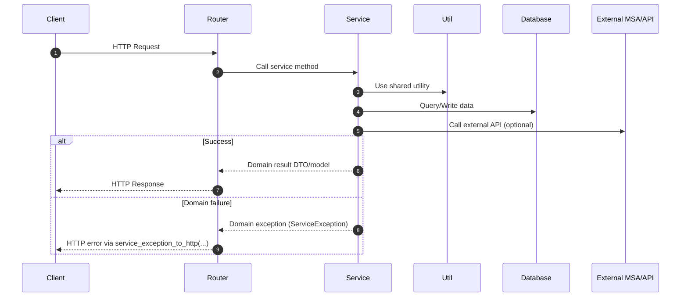
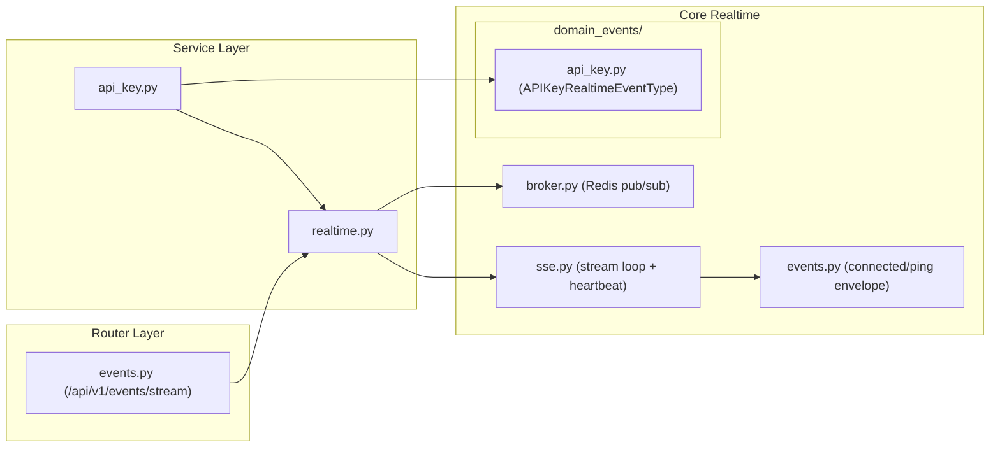

# 백엔드 엔지니어링 가이드

이 프로젝트는 에이전트 중심 코딩 패턴에 맞춰 최적화되어 있으며, 사람과 에이전트 모두 일관되고 높은 품질의 결과를 유지하기 위해 동일한 규칙을 따라야 합니다.

## 0) 범위와 우선순위

- 범위: `src/backend` 하위 전체
- 백엔드 작업 전 읽기 순서:

1. 루트 `AGENTS.md`
2. 이 문서 (`src/backend/BACKEND.md`)
3. 테스트 추가/변경 시 테스트 가이드 (`src/backend/TEST.md`)

- 충돌 시 우선순위:

1. 루트 `AGENTS.md`
2. 이 문서
3. 로컬 파일 주석 및 기존 코드 스타일

## 0.1) 백엔드 프로젝트 구조

```text
src/backend/
  alembic/
    env.py
    versions/
      0001_*.py
      0002_*.py
      ...
  app/
    core/
      database.py
      redis.py
      settings.py
      logging.py
      migrations.py
      task_queue/
        __init__.py
        bootstrap.py
        worker.py
        services/
          mail.py
          __init__.py
      realtime/
        events.py
        broker.py
        sse.py
        domain_events/
          api_key.py
      error/
        error.py
        auth_exception.py
        api_key_exception.py
    models/
      user.py
      api_key.py
      oauth.py
    routers/
      v1/
        auth.py
        api_key.py
        events.py
    services/
      auth.py
      api_key.py
      realtime.py
    utils/
      token.py
      cookies.py
      security.py
    deps.py
    main.py
  alembic.ini
  pyproject.toml
```

## 0.1.1) 디렉터리 책임

- `app/core/`
1. 애플리케이션 전역 인프라와 횡단 관심사
2. DB/Redis/설정/로깅 초기화 및 공통 에러 기반
3. 엔드포인트별 비즈니스 규칙 금지
4. 환경 변수 접근은 `app/core/settings.py`의 `SETTINGS`로 일원화
5. router/service/utils 전역에 `os.getenv(...)` 직접 사용 분산 금지
6. 시작 시 DB 마이그레이션 오케스트레이션은 `app/core/migrations.py`에 배치 (router/service/main 비즈니스 코드에 배치 금지)
7. 공용 비동기 큐 워커 오케스트레이션은 `app/core/task_queue/worker.py`에 배치
8. 도메인/서비스별 큐 어댑터(예: 이메일 전송)는 `app/core/task_queue/services/mail.py` 같은 전용 모듈에 배치
9. 태스크 큐 서비스 등록/부트스트랩 오케스트레이션은 `app/core/task_queue/bootstrap.py`와 `app/core/task_queue/services/__init__.py`에 배치

- `app/models/`
1. 데이터 형태 정의: SQLAlchemy 엔티티 및 API/Pydantic 스키마
2. 모델 도메인에 결합된 저장소 스타일 데이터 접근 헬퍼
3. HTTP 전송 처리 금지

- `app/routers/`
1. HTTP 전송 계층만 담당 (요청 파싱, 응답 매핑, status/response 선언)
2. 서비스 메서드 호출 및 도메인 예외를 HTTP 에러로 변환
3. 도메인 비즈니스 오케스트레이션 로직 포함 금지

- `app/services/`
1. 도메인 비즈니스 로직 및 오케스트레이션 계층
2. 모델/리포지토리, utils, DB, 외부 API 호출을 유스케이스 결과로 조합
3. 인프라/라이브러리 실패를 도메인 예외로 정규화

- `app/utils/`
1. 서비스 간 공유 가능한 재사용 기술 헬퍼
2. 보안/토큰/쿠키/세션/암호화 유틸 함수
3. 도메인 정책 결정 로직 보유 금지

- `app/core/realtime/`
1. SSE 전달을 위한 실시간 전송 프리미티브
2. 시스템 이벤트 스키마(`connected`, `ping`) + 브로커 fan-out(`broker.py`) + 스트림 heartbeat 루프(`sse.py`) 구성
3. 도메인 단위 실시간 이벤트 enum은 `app/core/realtime/domain_events/` 하위에 정의 (예시: `app/core/realtime/domain_events/api_key.py`의 `APIKeyRealtimeEventType`)
4. 서비스 계층에서 도메인 이벤트를 브로커 채널에 발행하고, 라우터는 `RealtimeService`를 통해 스트림을 소비

- `app/deps.py`
1. auth/session/API-key 컨텍스트 해석용 DI 진입점
2. 라우터에 request-scope 의존 객체 제공
3. 의존성 wiring에 집중하고 피처 비즈니스 워크플로 임베딩 방지
4. RBAC 가드(예: admin 전용 의존성)를 중앙화하여 라우터 중복 역할 체크 방지

- `app/static/`
1. 모놀리식 배포 모드에서 프론트 정적 아티팩트 위치
2. `app/main.py`에서 `app/static/dist`를 마운트하여 SPA 자산 직접 제공 가능
3. 비 API HTML 요청은 SPA fallback으로 `index.html` 라우팅 가능

## 0.2) DB 애플리케이션 구조 (Alembic 포함)

- 런타임 애플리케이션 경로:

1. `app/core/database.py`에서 DB 엔진/세션 팩토리 초기화
2. `app/models/*`에서 SQLAlchemy 모델/스키마 메타데이터 정의
3. `app/services/*`에서 모델/리포지토리 함수를 사용해 도메인 연산 수행

- 마이그레이션/버저닝 경로:

1. `alembic/env.py`에서 메타데이터 및 마이그레이션 컨텍스트 로드
2. `alembic/versions/*.py`에 버전 마이그레이션 스크립트 저장
3. `alembic.ini`에서 Alembic 런타임 동작 설정

- 역할 분리:

1. Alembic: 스키마 이력 및 통제된 마이그레이션 워크플로
2. 앱 런타임 DB 계층: 요청 시점 읽기/쓰기 연산



## 0.2.1) 모놀리식 정적 서빙 구조

- 이 프로젝트는 백엔드와 빌드된 프론트엔드를 함께 제공하는 모놀리식 서빙 모드를 지원합니다.
- 정적 아티팩트 기대 경로:
1. `src/backend/app/static/dist/`
- 모놀리식 모드 런타임 동작:
1. 백엔드는 `app/static/dist`를 static root로 마운트
2. 자산 파일은 마운트된 디렉터리에서 직접 제공
3. SPA 라우트(HTML accept 헤더를 가진 비 API 경로)는 `index.html` fallback 반환 가능
- 운영 참고:
1. `app/static/dist`에 프론트 빌드 결과가 없으면 static 마운트/fallback을 건너뜀

## 0.3) Router-Service-Util-DB 관계





## 0.4) 실시간 이벤트 프로젝트 패턴

- 규칙:
1. 공통 전송/시스템 실시간 로직은 `app/core/realtime/`에 유지 (`events.py`, `broker.py`, `sse.py`)
2. 도메인 소유 실시간 이벤트 타입은 `app/core/realtime/domain_events/`에 배치
3. 서비스는 `app.core.realtime`(re-export) 또는 `app.core.realtime.domain_events.<domain>`에서 이벤트 enum import
4. 라우터에서 실시간 이벤트 enum을 직접 정의/소유하지 않음



## 1) 포맷팅 및 린팅 (Ruff 우선)

- `src/backend/pyproject.toml`은 백엔드 툴링/의존성 설정의 단일 기준입니다.
- 기본 백엔드 패키지/런타임 워크플로는 `uv`를 사용합니다.
- `pyproject.toml`과 lockfile 변경은 같은 변경셋에서 동기화되어야 합니다.
- 파이썬 스타일의 단일 기준은 Ruff입니다.
- 커밋 전 필수:

1. `ruff check . --fix`
2. `ruff format .`

- CI/로컬 검증 필수:

1. `ruff check .`
2. `ruff format . --check`

- 라인 길이 및 포맷팅 동작은 `src/backend/pyproject.toml`의 Ruff 설정을 따릅니다.
- `black`/`isort` 섹션이 있더라도 Ruff 명령을 기본 워크플로로 사용합니다.

## 2) 타입 애노테이션 규칙

- 내장 파이썬 타입 문법을 우선 사용합니다.

1. `list[str]`, `dict[str, int]`, `set[str]`, `tuple[int, str]`
2. Optional은 `X | None`
3. Union은 `A | B`

- `typing.List`, `typing.Dict`, `typing.Optional`, `typing.Union` 사용 금지
- `Any`, `Literal`, `Annotated`, `TypeAlias`는 꼭 필요한 경우에만 사용
- 공개 함수(router 핸들러, 공개 service 메서드, 공개 util 함수)는 반환 타입 선언 필수
- private service 메서드도 가능하면 타입 선언 권장

## 3) 필수 레이어링 패턴 (Router -> Service -> Util/DB/MSA)

- 모든 요청 흐름은 다음 순서를 따라야 합니다.

1. Router: HTTP 전송 계층만
2. Service: 비즈니스 로직과 오케스트레이션
3. Util/DB/MSA: 서비스가 호출하는 실행 의존성

- Router 규칙:

1. 요청/응답 스키마 매핑, 쿠키/헤더, 응답 선언만 처리
2. 비즈니스 로직, 복잡한 도메인 분기, DB 직접 접근 금지
3. 서비스 메서드 호출 + 도메인 예외를 HTTP 에러로 변환

- Service 규칙:

1. 도메인 비즈니스 규칙의 단일 소유자
2. DB/Redis/외부 API 연산을 최종 비즈니스 결과로 조합
3. 복잡도는 private 메서드(`_...`)로 분해

- Util 규칙:

1. 여러 서비스에서 쓰는 재사용 헬퍼 배치
2. 쿠키/세션/토큰/암호화 같은 민감 기술 주제 중앙화
3. 서비스별 도메인 정책 결정은 util이 아닌 service private 메서드에 유지

## 4) 예외 모델링 규칙 (필수)

- 모든 도메인 예외는 `app/core/error/error.py`의 공통 기반을 사용해야 합니다.
- 필수 도메인 에러 모듈 패턴:

1. `app/core/error/<domain>_exception.py` 생성
2. `<Domain>ErrorCode(Enum)` 값을 `ServiceErrorCode(...)`로 정의
3. `<Domain>Exception(ServiceException)` 정의
4. `build_error_models(...)`로 OpenAPI 에러 모델 구성
5. `build_error_responses_from_codes(...)`로 응답 매핑 구성

- 1:1:1 매핑 규칙:

1. router 모듈 1개
2. service 모듈 1개
3. domain error 모듈 1개

- Router 전파 규칙:

1. 라우트 데코레이터 `responses=`에는 해당 핸들러에서 전파 가능한 도메인 에러를 모두 포함
2. 라우트 데코레이터에 `400/401/500` 같은 raw status 하드코딩 금지
3. `service_exception_to_http(...)`로 도메인 예외를 변환해 재-raise
4. 리다이렉트 기반 엔드포인트(예: OAuth callback)는 실패 경로가 리다이렉트라면 `responses=`에 JSON 도메인 에러 모델 문서화 금지
5. OpenAPI 생성 전에 라우트 데코레이터 응답 계약(JSON vs redirect)을 실제 전송 동작과 일치시킬 것

- Service raise 규칙:

1. 인프라/라이브러리 예외는 서비스 계층에서 캐치
2. 도메인 예외(`...Exception(code=...)`)로 변환 후 raise
3. 라우터는 서비스에서 온 도메인 예외만 처리

## 5) 예외 처리 및 로깅 패턴

- 책임 분리:

1. 서비스는 상세 실패 원인을 정규화
2. 라우터는 HTTP 변환 및 전송 계층 에러 로깅 수행

- 현재 프로젝트 로깅 동작:

1. 라우터는 서비스 예외를 `logger.error(... code=...)`로 로깅
2. 예기치 않은 에러는 `logger.exception(...)`으로 스택트레이스 유지
3. 이메일 등 민감 데이터는 마스킹 헬퍼 사용 필수

- 권장 운영 규칙:

1. 실패 로그에 에러 코드를 항상 포함
2. 동일 실패 경로에서 중복 에러 로그 방지
3. 재-raise 시 원인 보존 (`raise ... from error`)

## 6) 커밋 전 필수 체크

- 백엔드 관련 커밋은 아래 체크를 모두 통과해야 합니다.

1. `ruff check . --fix`
2. `ruff format .`
3. 수정 범위에 대한 최소 관련 테스트 실행 (테스트가 존재하는 경우)
4. OpenAPI 계약 변경 시 프론트 타입 생성 연동 흐름 검증
5. 의존성/툴링 변경 시 `pyproject.toml`과 lockfile이 `uv` 워크플로 기준으로 동기화되었는지 검증

- 테스트 아키텍처/네이밍/하네스 규칙은 `src/backend/TEST.md`를 따릅니다.
- 새 백엔드 도메인/라우터 추가 시 `src/backend/TEST.md`의 온보딩 체크리스트(`## 11) New Domain Test Onboarding Rules (Required)`)를 따릅니다.

- 위 조건을 만족하지 않으면 커밋하지 않습니다.

## 7) DB 마이그레이션 규칙 (Alembic)

- Alembic은 DB 스키마/마이그레이션 관리에만 사용합니다.
- Alembic 규칙은 Router -> Service -> Util/DB/MSA 레이어링 패턴을 변경하거나 제약하지 않습니다.
- 현재 런타임 부트스트랩 패턴(`create_all`)은 필요 시 로컬/개발 초기화 용도로 유지할 수 있습니다.
- 스키마 이력/버전 마이그레이션 관리가 필요할 때는 Alembic revision을 DB 변경 로그의 기준으로 사용합니다.
- SQLAlchemy 모델/스키마 추가/변경/삭제 시 Alembic 마이그레이션 업데이트는 필수입니다.
- 표준 워크플로:

1. 모델 업데이트
2. Alembic revision 생성
3. 마이그레이션 스크립트 검토 및 조정
4. `upgrade` 적용
5. `downgrade` 경로 검증

- 기본 명령 예시 (`src/backend`에서 실행):
1. `alembic revision --autogenerate -m "describe-schema-change"`
2. `alembic upgrade head`
3. `alembic downgrade -1`

- 주요 위치:

1. Config: `src/backend/alembic.ini`
2. Env 스크립트: `src/backend/alembic/env.py`
3. Revision 파일: `src/backend/alembic/versions/*.py`

- 규칙:

1. Revision 메시지/파일은 의도를 명확히 설명
2. 데이터 마이그레이션 로직은 가능하면 idempotent 하게 구현
3. FK/index/unique 변경의 downgrade 가능성 검증
4. Revision id는 `NNNN_snake_case` 형식
5. Revision id 길이는 32자 이하
6. 공유/운영 환경에서는 마이그레이션 실패 시 rollforward-first 원칙 적용 (기본: no downgrade)
7. 마이그레이션 사고 대응은 `src/backend/MIGRATION_ROLLFORWARD.md`를 따름
8. 백업/복구 작업은 `src/backend/DB_BACKUP_RESTORE.md`를 따름

## 8) 완료 체크리스트

1. 라우터에 비즈니스 로직이 없다
2. 서비스가 도메인 예외를 일관되게 raise 한다
3. `responses=` 선언이 실제 전파 에러와 일치한다
4. 타입 힌트가 내장 문법 규칙을 따른다
5. Ruff 체크/포맷팅이 통과한다
6. DB 변경이 있었다면 Alembic revision 및 upgrade 검증이 완료되었다
