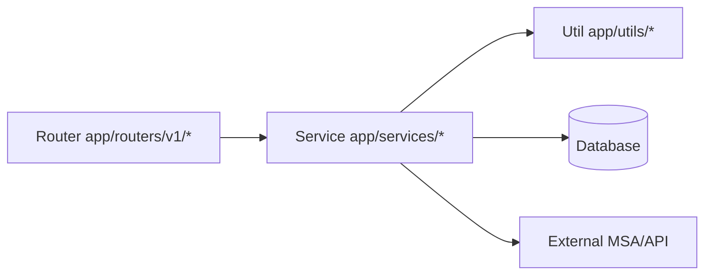

# 백엔드 빠른 가이드

이 문서는 `src/backend` 작업자를 위한 최소 참조 가이드입니다.
전체 엔지니어링 규칙은 `src/backend/BACKEND.md`를 따르세요.
백엔드 테스트 엔지니어링 규칙은 `src/backend/TEST.md`를 따르세요.

## 1) 핵심 규칙

- 레이어링 패턴: `Router -> Service -> Util/DB/MSA`
- 환경 변수는 `app/core/settings.py`의 `SETTINGS`를 통해 접근
- 스키마/모델이 바뀌면 Alembic 마이그레이션 업데이트 필수
- RBAC는 `app/deps.py` 의존성(예: admin 전용 가드)으로 강제
- `LOGIN_ENABLED=false` 부트스트랩 모드에서는 bootstrap 사용자를 `admin`으로 프로비저닝/승격
- 시작 시 백엔드는 현재 `DATABASE_URL`에 대해 Alembic `upgrade head`만 수행(다운그레이드 경로 없음)
- API 키는 누적 사용량(`request_count`)과 선택적 만료(`expires_at`)를 추적
- 실시간 SSE 스트림은 `/api/v1/events/stream`에서 제공되며 heartbeat 및 Redis Pub/Sub fan-out을 사용

## 1.1) 백엔드 흐름



## 2) 설정

```bash
cd src/backend
uv sync
```

## 3) 서버 실행

```bash
cd src/backend
uv run uvicorn app.main:app --reload --port 8000
```

API 문서:
- `http://localhost:8000/docs`

## 4) 린트 / 포맷 (Ruff)

```bash
cd src/backend
uv run ruff check . --fix
uv run ruff format .
```

체크 전용 모드:

```bash
cd src/backend
uv run ruff check .
uv run ruff format . --check
```

## 5) DB 마이그레이션 (Alembic)

모델/스키마 변경 후:

```bash
cd src/backend
uv run alembic revision --autogenerate -m "describe-schema-change"
uv run alembic upgrade head
```

롤백 예시:

```bash
cd src/backend
uv run alembic downgrade -1
```

## 6) 커밋 전 체크리스트

```bash
cd src/backend
uv run ruff check . --fix
uv run ruff format .
```

추가 확인:
- DB 변경 시 Alembic revision/upgrade 확인
- 동작/규칙 변경 시 `AGENTS.md`, 루트 `README.md`, `src/backend/BACKEND.md` 동기화

## 7) 마이그레이션 및 데이터 운영

- 마이그레이션 실패 대응: `src/backend/MIGRATION_ROLLFORWARD.md`
- DB 백업/복구 런북: `src/backend/DB_BACKUP_RESTORE.md`
- Alembic revision 규칙:
1. `revision` 형식: `NNNN_snake_case`
2. 최대 길이: `32`

## 8) 테스트 (도메인/API 구조)

- 테스트는 API 도메인 단위로 `tests/api/v1/<domain>/` 아래 구성
- 현재 시작 레이아웃:
1. `tests/api/v1/auth/test_auth_api.py`
2. `tests/api/v1/api_key/test_api_key_api.py`
3. `tests/api/v1/events/test_events_api.py`

테스트 실행:

```bash
cd src/backend
uv run pytest
```
