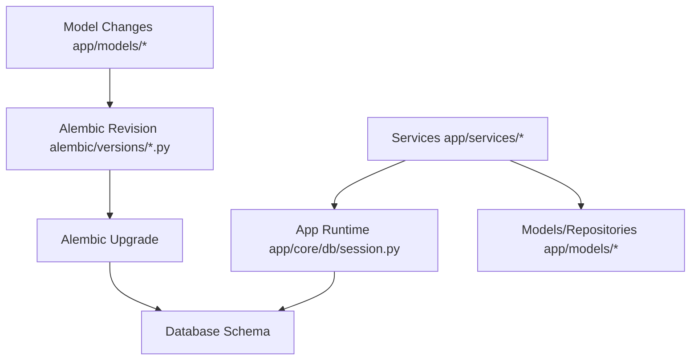
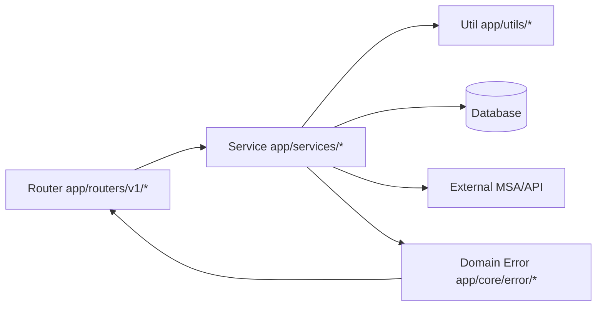
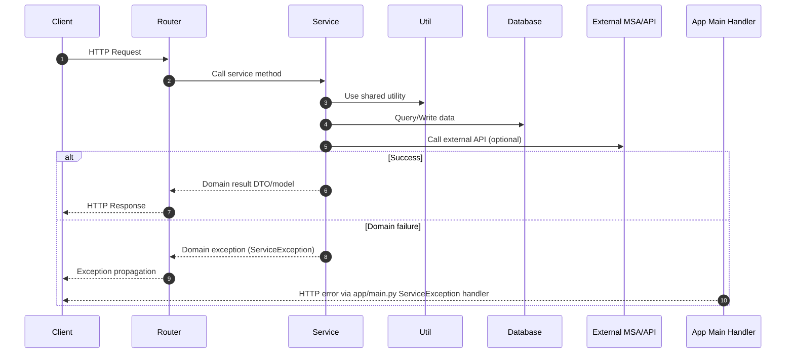
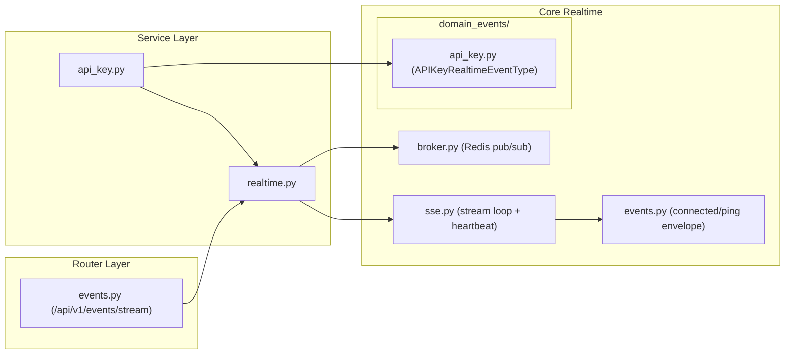

# 백엔드 엔지니어링 가이드

이 프로젝트는 에이전트 중심 코딩 패턴에 맞춰 최적화되어 있으며, 사람과 에이전트 모두 일관되고 높은 품질의 결과를 유지하기 위해 동일한 규칙을 따라야 합니다.

## 0) 범위와 우선순위

- 범위: `src/backend` 하위 전체
- 백엔드 작업 전 읽기 순서:

1. 루트 `AGENTS.md`
2. 이 문서 (`src/backend/BACKEND.md`)
3. 테스트 추가/변경 시 테스트 가이드 (`src/backend/TEST.md`)

- 충돌 시 우선순위:

1. 루트 `AGENTS.md`
2. 이 문서
3. 로컬 파일 주석 및 기존 코드 스타일

## 0.1) 백엔드 프로젝트 구조

```text
src/backend/
  alembic/
    env.py
    versions/
      0001_*.py
      0002_*.py
      ...
  app/
    core/
      config/
        settings.py
      db/
        session.py
        migrations.py
      cache/
        redis.py
      observability/
        logging.py
        request_context.py
        metrics.py
        health.py
        tracing.py
      mail/
        service.py
        templates.py
      task_queue/
        __init__.py
        bootstrap.py
        worker.py
        services/
          mail.py
          __init__.py
      realtime/
        events.py
        broker.py
        sse.py
        domain_events/
          api_key.py
      error/
        error.py
        auth_exception.py
        api_key_exception.py
    models/
      user.py
      api_key.py
      oauth.py
    routers/
      v1/
        auth.py
        api_key.py
        events.py
    services/
      auth.py
      api_key.py
      realtime.py
    utils/
      token.py
      cookies.py
      security.py
    deps.py
    main.py
  alembic.ini
  pyproject.toml
```

## 0.1.1) 디렉터리 책임

- `app/core/`
1. 애플리케이션 전역 인프라와 횡단 관심사
2. 엔드포인트별 비즈니스 규칙 금지
3. `app/core/config/`는 `SETTINGS` 기반 환경 설정을 담당
4. `app/core/db/`는 DB 엔진/세션 생명주기와 시작 시 스키마 마이그레이션 오케스트레이션을 담당
5. `app/core/cache/`는 Redis 같은 공용 cache/broker client를 담당
6. `app/core/observability/`는 logging, request correlation, metrics, tracing, health check를 담당
7. `app/core/mail/`은 mail provider/service와 email template을 담당
8. `app/core/error/`는 공통 도메인 에러 기반과 에러 응답 빌더를 담당
9. `app/core/realtime/`은 SSE 전송 프리미티브, broker fan-out, realtime event schema를 담당
10. `app/core/task_queue/`는 공용 비동기 큐 워커와 등록된 도메인 큐 서비스를 담당
11. router/service/utils 전역에 `os.getenv(...)` 직접 사용 분산 금지

- `app/models/`
1. 데이터 형태 정의: SQLAlchemy 엔티티 및 API/Pydantic 스키마
2. 모델 도메인에 결합된 저장소 스타일 데이터 접근 헬퍼
3. HTTP 전송 처리 금지

- `app/routers/`
1. HTTP 전송 계층만 담당 (요청 파싱, 응답 매핑, status/response 선언)
2. 서비스 메서드 호출 및 도메인 예외를 전역 앱 핸들러로 전파
3. 도메인 비즈니스 오케스트레이션 로직 포함 금지

- `app/services/`
1. 도메인 비즈니스 로직 및 오케스트레이션 계층
2. 모델/리포지토리, utils, DB, 외부 API 호출을 유스케이스 결과로 조합
3. 인프라/라이브러리 실패를 도메인 예외로 정규화

- `app/utils/`
1. 서비스 간 공유 가능한 재사용 기술 헬퍼
2. 보안/토큰/쿠키/세션/암호화 유틸 함수
3. 도메인 정책 결정 로직 보유 금지

- `app/core/realtime/`
1. SSE 전달을 위한 실시간 전송 프리미티브
2. 시스템 이벤트 스키마(`connected`, `ping`) + 브로커 fan-out(`broker.py`) + 스트림 heartbeat 루프(`sse.py`) 구성
3. 도메인 단위 실시간 이벤트 enum은 `app/core/realtime/domain_events/` 하위에 정의 (예시: `app/core/realtime/domain_events/api_key.py`의 `APIKeyRealtimeEventType`)
4. 서비스 계층에서 도메인 이벤트를 브로커 채널에 발행하고, 라우터는 `RealtimeService`를 통해 스트림을 소비

- `app/deps.py`
1. auth/session/API-key 컨텍스트 해석용 DI 진입점
2. 라우터에 request-scope 의존 객체 제공
3. 의존성 wiring에 집중하고 피처 비즈니스 워크플로 임베딩 방지
4. RBAC 가드(예: admin 전용 의존성)를 중앙화하여 라우터 중복 역할 체크 방지

- `app/static/`
1. 모놀리식 배포 모드에서 프론트 정적 아티팩트 위치
2. `app/main.py`에서 `app/static/dist`를 마운트하여 SPA 자산 직접 제공 가능
3. 비 API HTML 요청은 SPA fallback으로 `index.html` 라우팅 가능

## 0.2) DB 애플리케이션 구조 (Alembic 포함)

- 런타임 애플리케이션 경로:

1. `app/core/db/session.py`에서 DB 엔진/세션 팩토리 초기화
2. `app/models/*`에서 SQLAlchemy 모델/스키마 메타데이터 정의
3. `app/services/*`에서 모델/리포지토리 함수를 사용해 도메인 연산 수행

- 마이그레이션/버저닝 경로:

1. `alembic/env.py`에서 메타데이터 및 마이그레이션 컨텍스트 로드
2. `alembic/versions/*.py`에 버전 마이그레이션 스크립트 저장
3. `alembic.ini`에서 Alembic 런타임 동작 설정

- 역할 분리:

1. Alembic: 스키마 이력 및 통제된 마이그레이션 워크플로
2. 앱 런타임 DB 계층: 요청 시점 읽기/쓰기 연산



## 0.2.1) 모놀리식 정적 서빙 구조

- 이 프로젝트는 백엔드와 빌드된 프론트엔드를 함께 제공하는 모놀리식 서빙 모드를 지원합니다.
- 정적 아티팩트 기대 경로:
1. `src/backend/app/static/dist/`
- 모놀리식 모드 런타임 동작:
1. 백엔드는 `app/static/dist`를 static root로 마운트
2. 자산 파일은 마운트된 디렉터리에서 직접 제공
3. SPA 라우트(HTML accept 헤더를 가진 비 API 경로)는 `index.html` fallback 반환 가능
- 운영 참고:
1. `app/static/dist`에 프론트 빌드 결과가 없으면 static 마운트/fallback을 건너뜀

## 0.3) Router-Service-Util-DB 관계





## 0.4) 실시간 이벤트 프로젝트 패턴

- 규칙:
1. 공통 전송/시스템 실시간 로직은 `app/core/realtime/`에 유지 (`events.py`, `broker.py`, `sse.py`)
2. 도메인 소유 실시간 이벤트 타입은 `app/core/realtime/domain_events/`에 배치
3. 서비스는 `app.core.realtime`(re-export) 또는 `app.core.realtime.domain_events.<domain>`에서 이벤트 enum import
4. 라우터에서 실시간 이벤트 enum을 직접 정의/소유하지 않음



## 0.5) 백엔드 런타임 루프

백엔드 동작을 추가하거나 변경할 때 다음 루프를 기본 확인 항목으로 사용합니다. 해당하지 않는 루프는 “해당 없음”으로 볼 수 있지만, 커밋 전에 이유가 명확해야 합니다.

### 0.5.1) Request Lifecycle 루프

새 API 동작은 다음 경로를 따라야 합니다.

1. 요청은 `app/routers/v1/*`로 진입
2. auth/session/request context는 `app/deps.py`를 통해 해석
3. 라우터는 비즈니스 작업을 `app/services/*`에 위임
4. 서비스는 model, repository, DB session, shared utility를 통해 읽기/쓰기 수행
5. 서비스는 도메인 결과를 반환하거나 도메인 예외를 발생
6. 라우터/전역 핸들러는 결과 또는 에러를 HTTP 응답으로 매핑

라우터가 서비스 오케스트레이션, 직접 DB 정책, 임의 에러 응답 생성을 포함해 이 루프를 우회하면 안 됩니다.

### 0.5.2) Domain Event 루프

백엔드 변경이 즉시 HTTP 응답 밖에서도 반영되어야 한다면 domain event 루프를 사용합니다.

1. 서비스가 상태를 변경하는 도메인 액션 완료
2. 서비스가 realtime broker 경로를 통해 타입이 있는 도메인 이벤트 발행
3. realtime transport가 이벤트를 직렬화하고 스트리밍
4. 프론트엔드 realtime hook이 이벤트를 소비하고 영향을 받는 상태를 refresh 또는 update

라우터에서 transport-specific 이벤트를 직접 발행하지 않습니다. 이벤트 이름과 payload는 `app/core/realtime/domain_events/` 아래에서 도메인 단위와 타입을 유지합니다.

### 0.5.3) Background Task 루프

느리거나, 재시도 가능하거나, HTTP 응답 전에 완료될 필요가 없는 작업은 background task 루프를 사용합니다.

1. 요청 처리 또는 도메인 서비스가 필요한 최소 payload로 task enqueue
2. worker 소유 서비스가 side effect 실행
3. 실패는 worker/service 경계에서 logging 및 정규화
4. 호출자가 후속 상태를 알아야 하면 완료/실패를 status update, domain event, observable log로 노출

queued task가 retry와 실패 동작을 더 명확하게 만들 수 있다면 장시간 외부 호출을 request handler 안에 숨기지 않습니다.

## 1) 포맷팅 및 린팅 (Ruff 우선)

- `src/backend/pyproject.toml`은 백엔드 툴링/의존성 설정의 단일 기준입니다.
- 기본 백엔드 패키지/런타임 워크플로는 `uv`를 사용합니다.
- `pyproject.toml`과 lockfile 변경은 같은 변경셋에서 동기화되어야 합니다.
- 파이썬 스타일의 단일 기준은 Ruff입니다.
- 커밋 전 필수:

1. `ruff check . --fix`
2. `ruff format .`

- CI/로컬 검증 필수:

1. `ruff check .`
2. `ruff format . --check`

- 라인 길이 및 포맷팅 동작은 `src/backend/pyproject.toml`의 Ruff 설정을 따릅니다.
- `black`/`isort` 섹션이 있더라도 Ruff 명령을 기본 워크플로로 사용합니다.

## 2) 타입 애노테이션 규칙

- 내장 파이썬 타입 문법을 우선 사용합니다.

1. `list[str]`, `dict[str, int]`, `set[str]`, `tuple[int, str]`
2. Optional은 `X | None`
3. Union은 `A | B`

- `typing.List`, `typing.Dict`, `typing.Optional`, `typing.Union` 사용 금지
- `Any`, `Literal`, `Annotated`, `TypeAlias`는 꼭 필요한 경우에만 사용
- 공개 함수(router 핸들러, 공개 service 메서드, 공개 util 함수)는 반환 타입 선언 필수
- private service 메서드도 가능하면 타입 선언 권장

## 3) 필수 레이어링 패턴 (Router -> Service -> Util/DB/MSA)

- 모든 요청 흐름은 다음 순서를 따라야 합니다.

1. Router: HTTP 전송 계층만
2. Service: 비즈니스 로직과 오케스트레이션
3. Util/DB/MSA: 서비스가 호출하는 실행 의존성

- Router 규칙:

1. 요청/응답 스키마 매핑, 쿠키/헤더, 응답 선언만 처리
2. 비즈니스 로직, 복잡한 도메인 분기, DB 직접 접근 금지
3. 서비스 메서드 호출 후 도메인 예외는 `app/main.py`로 전파

- Service 규칙:

1. 도메인 비즈니스 규칙의 단일 소유자
2. DB/Redis/외부 API 연산을 최종 비즈니스 결과로 조합
3. 복잡도는 private 메서드(`_...`)로 분해

- Util 규칙:

1. 여러 서비스에서 쓰는 재사용 헬퍼 배치
2. 쿠키/세션/토큰/암호화 같은 민감 기술 주제 중앙화
3. 서비스별 도메인 정책 결정은 util이 아닌 service private 메서드에 유지

## 4) 예외 모델링 규칙 (필수)

- 모든 도메인 예외는 `app/core/error/error.py`의 공통 기반을 사용해야 합니다.
- 필수 도메인 에러 모듈 패턴:

1. `app/core/error/<domain>_exception.py` 생성
2. `<Domain>ErrorCode(Enum)` 값을 `ServiceErrorCode(...)`로 정의
3. `<Domain>Exception(ServiceException)` 정의
4. `build_error_models(...)`로 OpenAPI 에러 모델 구성
5. `build_error_responses_from_codes(...)`로 응답 매핑 구성

- 1:1:1 매핑 규칙:

1. router 모듈 1개
2. service 모듈 1개
3. domain error 모듈 1개

- Router 전파 규칙:

1. 라우트 데코레이터 `responses=`에는 해당 핸들러에서 전파 가능한 도메인 에러를 모두 포함
2. 라우트 데코레이터에 `400/401/500` 같은 raw status 하드코딩 금지
3. 일반 서비스 호출을 도메인 예외 변환만을 위해 `try/except`로 감싸지 않음
4. 리다이렉트 기반 엔드포인트(예: OAuth callback)는 실패 경로가 리다이렉트라면 `responses=`에 JSON 도메인 에러 모델 문서화 금지
5. OpenAPI 생성 전에 라우트 데코레이터 응답 계약(JSON vs redirect)을 실제 전송 동작과 일치시킬 것
6. 라우터는 redirect 실패 계약이나 쿠키 정리 후 재-raise 같은 전송 계층 특수 부수효과가 있을 때만 도메인 예외를 catch 할 수 있음

- Service raise 규칙:

1. 인프라/라이브러리 예외는 서비스 계층에서 캐치
2. 도메인 예외(`...Exception(code=...)`)로 변환 후 raise
3. `app/main.py`의 전역 예외 핸들러가 `ServiceException`을 HTTP JSON 응답으로 변환

## 5) 예외 처리 및 로깅 패턴

- 책임 분리:

1. 서비스는 상세 실패 원인을 정규화
2. `app/main.py`가 공통 도메인 예외의 HTTP 변환 및 에러 로깅 수행
3. 라우터는 엔드포인트별 전송 계층 동작만 처리

- 현재 프로젝트 로깅 동작:

1. 전역 `ServiceException` 핸들러가 `exception_log_level`로 레벨을 결정하고 `logger.log(... code=...)`로 로깅
2. 예기치 않은 에러는 `logger.exception(...)`으로 스택트레이스 유지
3. 이메일 등 민감 데이터는 마스킹 헬퍼 사용 필수
4. HTTP 요청 상관관계는 `X-Request-ID`와 `X-Trace-ID`를 사용하며, 로그는 request context logging을 통해 두 값을 포함
5. 런타임 로그 포맷은 key-value prefix(`level`, `logger`, `request_id`, `trace_id`) 뒤에 `message`를 붙이는 형식 사용

- 권장 운영 규칙:

1. 실패 로그에 에러 코드를 항상 포함
2. 동일 실패 경로에서 중복 에러 로그 방지
3. 재-raise 시 원인 보존 (`raise ... from error`)
4. 인바운드 `X-Request-ID`가 있으면 보존하고, 활성 OpenTelemetry trace ID를 우선 사용하고 활성 span이 없으면 기존 헤더 대체 순서를 사용
5. 애플리케이션 로그 메시지는 기존 event style인 `Event description (key=%s, other_key=%s).` 형태 유지

## 6) 커밋 전 필수 체크

- 백엔드 관련 커밋은 아래 체크를 모두 통과해야 합니다.

1. `ruff check . --fix`
2. `ruff format .`
3. 수정 범위에 대한 최소 관련 테스트 실행 (테스트가 존재하는 경우)
4. OpenAPI 계약 변경 시 프론트 타입 생성 연동 흐름 검증
5. 의존성/툴링 변경 시 `pyproject.toml`과 lockfile이 `uv` 워크플로 기준으로 동기화되었는지 검증

- 테스트 아키텍처/네이밍/하네스 규칙은 `src/backend/TEST.md`를 따릅니다.
- 새 백엔드 도메인/라우터 추가 시 `src/backend/TEST.md`의 온보딩 체크리스트(`## 11) New Domain Test Onboarding Rules (Required)`)를 따릅니다.

- 위 조건을 만족하지 않으면 커밋하지 않습니다.

## 7) DB 마이그레이션 규칙 (Alembic)

- Alembic은 DB 스키마/마이그레이션 관리에만 사용합니다.
- Alembic 규칙은 Router -> Service -> Util/DB/MSA 레이어링 패턴을 변경하거나 제약하지 않습니다.
- 현재 런타임 부트스트랩 패턴(`create_all`)은 필요 시 로컬/개발 초기화 용도로 유지할 수 있습니다.
- 스키마 이력/버전 마이그레이션 관리가 필요할 때는 Alembic revision을 DB 변경 로그의 기준으로 사용합니다.
- SQLAlchemy 모델/스키마 추가/변경/삭제 시 Alembic 마이그레이션 업데이트는 필수입니다.
- 표준 워크플로:

1. 모델 업데이트
2. Alembic revision 생성
3. 마이그레이션 스크립트 검토 및 조정
4. `upgrade` 적용
5. `downgrade` 경로 검증

- 기본 명령 예시 (`src/backend`에서 실행):
1. `alembic revision --autogenerate -m "describe-schema-change"`
2. `alembic upgrade head`
3. `alembic downgrade -1`

- 주요 위치:

1. Config: `src/backend/alembic.ini`
2. Env 스크립트: `src/backend/alembic/env.py`
3. Revision 파일: `src/backend/alembic/versions/*.py`

- 규칙:

1. Revision 메시지/파일은 의도를 명확히 설명
2. 데이터 마이그레이션 로직은 가능하면 idempotent 하게 구현
3. FK/index/unique 변경의 downgrade 가능성 검증
4. Revision id는 `NNNN_snake_case` 형식
5. Revision id 길이는 32자 이하
6. 공유/운영 환경에서는 마이그레이션 실패 시 rollforward-first 원칙 적용 (기본: no downgrade)
7. 마이그레이션 사고 대응은 `src/backend/MIGRATION_ROLLFORWARD.md`를 따름
8. 백업/복구 작업은 `src/backend/DB_BACKUP_RESTORE.md`를 따름

## 8) 완료 체크리스트

1. 라우터에 비즈니스 로직이 없다
2. 서비스가 도메인 예외를 일관되게 raise 한다
3. `responses=` 선언이 실제 전파 에러와 일치한다
4. 타입 힌트가 내장 문법 규칙을 따른다
5. Ruff 체크/포맷팅이 통과한다
6. DB 변경이 있었다면 Alembic revision 및 upgrade 검증이 완료되었다

## API 계약 기준 관리

- 라우터·모델 변경 시 루트 `make contract-export`로 `contracts/openapi.json`을 갱신하고 `make frontend-api-generate`로 프론트 타입을 생성합니다.
- `make contract-check`는 백엔드와 기준 파일의 일치를 검사합니다. 동작 계약은 `contracts/README.md`, 한국어는 `notes/ko/contracts/README.md`를 따릅니다.
- `get_current_user` 사용 라우터는 `current_user_error_responses(...)`로 인증·API Key 오류와 도메인 오류를 병합합니다. 동일 상태 코드의 응답 모델을 덮어쓰지 않습니다.
- `app/core/openapi.py`는 SSE 데이터 스키마와 기존 INTERNAL_ERROR 응답을 문서화합니다. SSE 본문은 문자열 스트림이며 JSON data 모델은 `x-sse-event-schema`로 연결합니다.
- 오류 형식·쿠키·refresh 동작을 바꾸려면 문서 변경과 별도의 동작 호환성 검토가 필요합니다.

## 서비스 관측 데코레이터

`app.core.observability.service`의 `@observe_service("api_key.create")`를
비동기 서비스 메서드에 적용합니다. API Key 생성·조회·삭제·상태 변경에 적용되어 있습니다.
고정 작업명, 결과(`success`, `error`, `cancelled`, `aborted`), 소요 시간(ms),
도메인 에러 코드 또는 `INTERNAL_ERROR`를 완료 시 DEBUG 로그 한 건으로 기록합니다.
기존 요청 컨텍스트 로깅을 사용하며 상세 오류 로그는 전역 핸들러가 담당합니다.

`TRACING_ENABLED=true`이면 활성 컨텍스트 아래에 서비스 span을 생성합니다.
기존 SQL·Redis 계측이 켜져 있으면 서비스 span 아래에 연결됩니다. 시작 시 기존
tracing provider/exporter 설정이 필요합니다. 완료 로그는 DEBUG 수준에서 출력합니다.
작업명과 소요 시간은 span 이름과 기본 타임스탬프를 사용하며 사용자 정의 속성은 결과와 에러 코드만 기록합니다.
성공 span은 기본 UNSET 상태를 유지합니다.
새 Prometheus 메트릭은 추가하지 않습니다.

작업명에 요청 데이터를 넣지 않습니다. 데코레이터는 인자·반환값·예외 메시지·스택을
기록하지 않습니다. 이 제한은 해당 데코레이터에 적용되며 다른 계측의 수집 정책은 별개입니다.
반환값·예외·취소·함수 메타데이터를 보존합니다. span 생명주기는 `start_as_current_span`이 관리하며,
데코레이터에서 관측 처리 오류를 조용히 무시하지 않습니다.
동기 함수와 async generator는 지원하지 않습니다. 라우터·SSE iterator 대신 서비스 경계에 적용합니다.
성공은 이벤트 발행을 포함한 메서드 전체의 정상 반환을 뜻하며 트랜잭션·전달 보장을 추가하지 않습니다.

## Trace ID 연결

로그와 `X-Trace-ID`는 유효한 활성 OpenTelemetry span의 trace ID를 우선 사용합니다.
FastAPI 계측이 사용자 미들웨어 바깥을 감싸므로 요청 컨텍스트 미들웨어에서 서버 span을 읽습니다.
인바운드 `traceparent`는 OTel propagator가 처리하며, 다른 `X-Trace-ID`가 활성 span을 덮어쓰지 않습니다.
샘플링되지 않은 span도 유효한 ID를 사용하지만 Tempo에 저장되지 않을 수 있습니다.
활성 span이 없으면(트레이싱 비활성화·제외 경로 등) 기존 순서인 traceparent의 ID,
X-Trace-ID, 새로 생성한 ID를 사용합니다. 이 대체 ID는 Tempo에 trace가 존재한다는 보장이 아닙니다.
`X-Request-ID` 동작은 유지합니다. 로그 생성 시에도 활성 span을 먼저 조회하고 없으면
요청 ContextVar를 사용합니다. 큐 로그 연결은 아래 규칙을 따르며 OTel span 전파는 별도 작업입니다.

## Worker 로그 연결

`RedisTaskQueueWorker._process_envelope`는 `task_log_context`로 작업 ID와 전달받은
trace ID를 설정하고 검증·observer·handler·재시도·DLQ 처리까지 유지합니다.
작업 ID가 없으면 생성하여 envelope에 저장하므로 재시도에도 동일하게 유지됩니다.
작업 범위의 로그 레코드에는 task_id가 들어가며 INFO·WARNING·오류 출력에도
두 ID가 표시됩니다. trace ID가 없으면 빈 값(텍스트에서는 `-`)을 사용하고 이전 작업이나
호출자의 ID를 사용하지 않습니다. HTTP request ID도 가져오지 않습니다.
정상 반환·예외·취소 시 컨텍스트 매니저가 이전 컨텍스트를 복원합니다.
로그 factory와 filter는 공통 필드 설정 함수를 사용합니다.
작업 trace ID는 원래 요청과 로그를 연결하기 위한 값이며 OTel 부모 span을 연결하거나
새로 생성하지 않습니다. Redis 등 자동 계측 span의 trace ID는 별개일 수 있습니다.
HTTP 로그 정책은 유지하며 enqueue DEBUG 로그에도 envelope의 ID를 기록합니다.

## 전역 예외 로그 레벨

`app/core/observability/error_logging.py`에서 전역 핸들러의 레벨을 결정합니다.

- 도메인 HTTP 5xx: 에러 코드와 관계없이 ERROR.
- INVALID_CREDENTIALS, INVALID_TOKEN, ACCOUNT_LOCKED, INSUFFICIENT_ROLE,
  OAUTH_IDENTITY_CONFLICT, API_KEY_INVALID, API_KEY_USER_MISMATCH: WARNING.
- HTTP 429: WARNING.
- 그 외 도메인 4xx: INFO. 이름·이메일 중복, 리소스 없음,
  LOGIN_DISABLED, EMAIL_DISABLED, EMAIL_NOT_VERIFIED 등을 포함합니다.
- 기존 일반 HTTPException fallback은 401/403/429에 WARNING,
  그 외 4xx에 INFO, 5xx 또는 예상 밖 상태 범주에 ERROR를 사용합니다.
- 예상하지 못한 일반 예외는 스택을 포함한 ERROR를 유지합니다.

로그 레벨만 변경하며 응답 상태·본문·에러 코드·핸들러 등록은 유지합니다.
프레임워크의 검증·HTTP 핸들러와 OAuth 리다이렉트 로그는 기존 동작을 유지합니다.
메일·Worker 재시도 로그는 이번 정책 범위에 포함하지 않습니다.
HTTP INFO·WARNING의 컨텍스트 표시는 기존 formatter 정책을 따릅니다.

## 메일·Worker 로그 책임

MailService는 발송 시도를 DEBUG, provider 전송 완료를 수신자 마스킹과 함께 INFO로 기록합니다.
이는 provider 호출 완료이며 실제 수신함 도착을 보장하는 로그는 아닙니다.
메일 큐 handler의 중복 성공 로그는 제거하고 공통 Worker의 작업 완료 DEBUG는 유지합니다.
발송을 건너뛰는 경우에는 기존 skip 로그를 유지합니다.
`raise_on_failure=True`이면 MailService는 예외를 기록하지 않고 호출자에게 전달합니다.
`raise_on_failure=False`이면 ERROR와 스택을 기록한 뒤 예외를 삼키는 기존 동작을 유지합니다.
Worker는 재시도 예약을 스택 없는 WARNING, 최종 DLQ 이동을 원래 예외 스택이 있는 ERROR로 기록합니다.
작업 컨텍스트의 task_id·trace_id는 유지합니다. 재시도 횟수·지연·큐 payload·메일 전송 동작은
변경하지 않습니다. observer·시작 과정의 다른 오류 로그는 이번 정책에 포함하지 않습니다.
