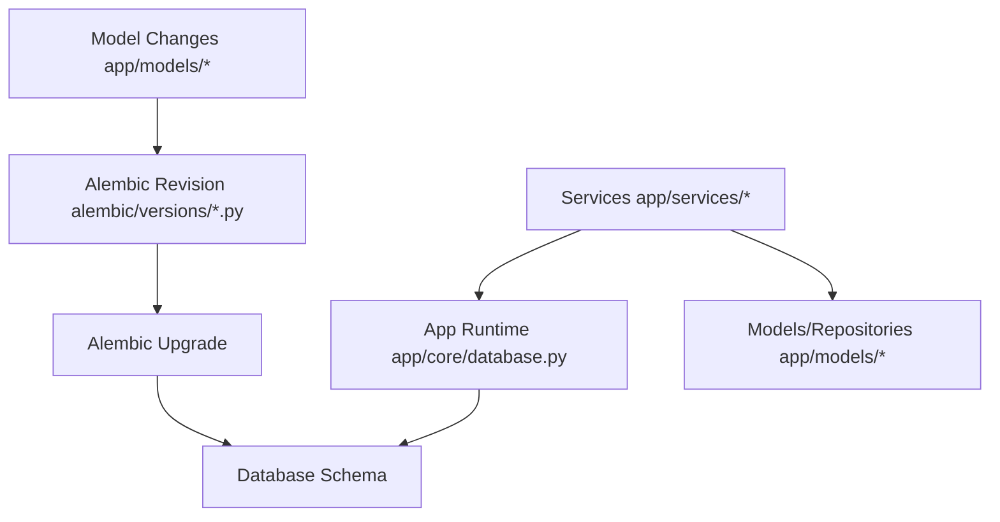
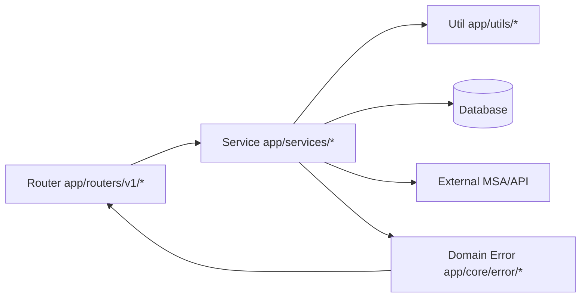
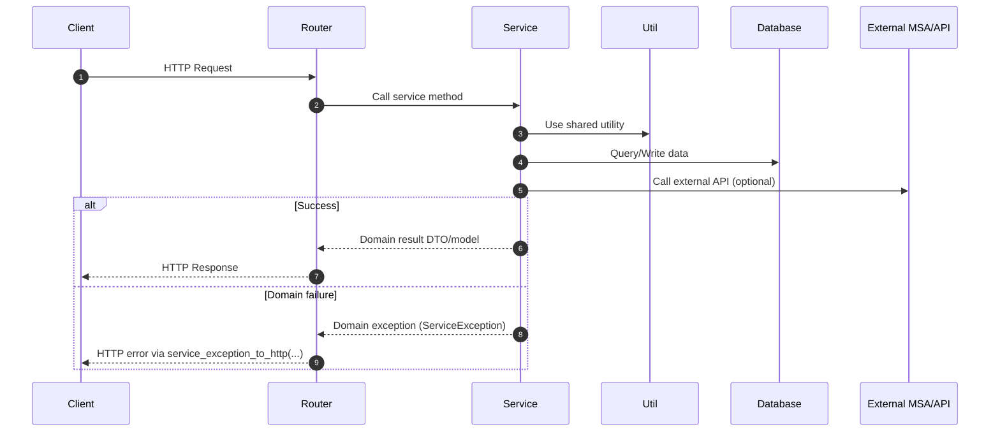

# Backend Engineering Guide

This guide exists because the project is optimized for agentic coding patterns, and both agents and humans are expected to follow the same conventions to maintain highly consistent, high-quality outcomes.

## 0) Scope and Priority

- Scope: everything under `src/backend`.
- Read order before backend work:

1. Root `AGENTS.md`
2. This document (`src/backend/BACKEND.md`)

- Priority on conflicts:

1. Root `AGENTS.md`
2. This document
3. Local file comments and existing code style

## 0.1) Backend Project Structure

```text
src/backend/
  alembic/
    env.py
    versions/
      0001_*.py
      0002_*.py
      ...
  app/
    core/
      database.py
      redis.py
      settings.py
      logging.py
      error/
        error.py
        auth_exception.py
        api_key_exception.py
    models/
      user.py
      api_key.py
      oauth.py
    routers/
      v1/
        auth.py
        api_key.py
    services/
      auth.py
      api_key.py
    utils/
      token.py
      cookies.py
      security.py
    deps.py
    main.py
  alembic.ini
  pyproject.toml
```

## 0.1.1) Directory Responsibilities

- `app/core/`
1. Application-wide infrastructure and cross-cutting concerns
2. DB/Redis/settings/logging initialization and shared error foundation
3. No endpoint-specific business rules
4. Environment variable access is centralized in `app/core/settings.py` via `SETTINGS`
5. Do not scatter direct `os.getenv(...)` usage across routers/services/utils

- `app/models/`
1. Data shape definitions: SQLAlchemy entities and API/Pydantic schemas
2. Repository-style data access helpers tied to model domain
3. No HTTP transport handling

- `app/routers/`
1. HTTP transport layer only (request parsing, response mapping, status/response declarations)
2. Calls service methods and converts domain exceptions to HTTP errors
3. Must not contain domain business orchestration logic

- `app/services/`
1. Domain business logic and orchestration layer
2. Composes models/repositories, utils, DB, and external API calls into use-case outcomes
3. Normalizes infra/library failures into domain exceptions

- `app/utils/`
1. Reusable technical helpers shared across services
2. Security/token/cookie/session/crypto-style utility functions
3. Should not own domain policy decisions

- `app/deps.py`
1. Dependency injection entry points for auth/session/API-key context resolution
2. Provides request-scoped dependency objects to routers
3. Keeps dependency wiring focused and avoids embedding feature business workflows

- `app/static/`
1. Static frontend artifact location for monolithic deployment mode
2. `app/main.py` can mount `app/static/dist` and serve SPA assets directly
3. Non-API HTML requests can be routed to `index.html` via SPA fallback behavior

## 0.2) Database Application Structure (Including Alembic)

- Runtime application path:

1. `app/core/database.py` initializes DB engine/session factory
2. `app/models/*` defines SQLAlchemy models and schema metadata
3. `app/services/*` executes domain operations using model/repository functions

- Migration/versioning path:

1. `alembic/env.py` loads metadata and migration context
2. `alembic/versions/*.py` stores versioned migration scripts
3. `alembic.ini` configures Alembic runtime behavior

- Role split:

1. Alembic: schema history and controlled migration workflow
2. App runtime DB layer: request-time read/write operations



## 0.2.1) Monolithic Static Serving Structure

- This project supports a monolithic serving mode where backend and built frontend are served together.
- Expected static artifact path:
1. `src/backend/app/static/dist/`
- Runtime behavior in monolithic mode:
1. Backend mounts `app/static/dist` as static root
2. Asset files are served directly from the mounted directory
3. For SPA routes (non-API paths with HTML accept header), backend can return `index.html` fallback
- Operational note:
1. If frontend build output is not present under `app/static/dist`, static mount/fallback is skipped

## 0.3) Router-Service-Util-DB Relationship





## 1) Formatting and Linting (Ruff-First)

- `src/backend/pyproject.toml` is the source of truth for backend tooling/dependency configuration.
- Use `uv` as the default backend package/runtime workflow.
- Keep `pyproject.toml` and lockfile changes consistent in the same change set.
- Ruff is the single source of truth for Python style.
- Required before commit:

1. `ruff check . --fix`
2. `ruff format .`

- Required for CI/local verification:

1. `ruff check .`
2. `ruff format . --check`

- Line length and formatting behavior must follow `src/backend/pyproject.toml` Ruff settings.
- Even if `black`/`isort` sections exist, use Ruff commands as the primary workflow.

## 2) Type Annotation Rules

- Prefer built-in Python type syntax.

1. `list[str]`, `dict[str, int]`, `set[str]`, `tuple[int, str]`
2. Optional as `X | None`
3. Union as `A | B`

- Do not use `typing.List`, `typing.Dict`, `typing.Optional`, `typing.Union`.
- Use `Any`, `Literal`, `Annotated`, `TypeAlias` only when truly needed.
- Public functions (router handlers, public service methods, public util functions) must declare return types.
- Private service methods should also declare types whenever practical.

## 3) Mandatory Layering Pattern (Router -> Service -> Util/DB/MSA)

- Every request flow must follow this order:

1. Router: HTTP transport layer only
2. Service: business logic and orchestration
3. Util/DB/MSA: execution dependencies called by services

- Router rules:

1. Handle request/response schema mapping, cookies/headers, and response declarations only
2. No business logic, no complex domain branching, no direct DB access
3. Call service methods and convert domain exceptions to HTTP errors

- Service rules:

1. Single owner of domain business rules
2. Compose DB/Redis/external API operations into final business outcomes
3. Break complexity into private methods (`_...`)

- Util rules:

1. Place reusable helpers used by multiple services
2. Centralize sensitive technical topics (cookies, sessions, tokens, crypto)
3. Service-specific domain decisions stay in service private methods, not util modules

## 4) Exception Modeling Rules (Required)

- All domain exceptions must use the shared foundation in `app/core/error/error.py`.
- Required domain error module pattern:

1. Create `app/core/error/<domain>_exception.py`
2. Define `<Domain>ErrorCode(Enum)` values as `ServiceErrorCode(...)`
3. Define `<Domain>Exception(ServiceException)`
4. Build OpenAPI error models via `build_error_models(...)`
5. Build response mappings via `build_error_responses_from_codes(...)`

- 1:1:1 mapping rule:

1. One router module
2. One service module
3. One domain error module

- Router propagation rules:

1. Route decorator `responses=` must include all domain errors that can be propagated by that handler
2. Do not hard-code raw status numbers such as `400/401/500` in route decorators
3. Convert domain exceptions using `service_exception_to_http(...)` and re-raise

- Service raise rules:

1. Catch infra/library exceptions in the service layer
2. Translate to domain exceptions (`...Exception(code=...)`) and raise
3. Router should only handle domain exceptions from services

## 5) Exception Handling and Logging Pattern

- Responsibility split:

1. Services normalize detailed failure causes
2. Routers perform HTTP conversion and transport-layer error logging

- Current project logging behavior:

1. Router logs service exceptions with `logger.error(... code=...)`
2. Unexpected errors use `logger.exception(...)` to keep stack traces
3. Sensitive data (for example email) must use masking helpers

- Recommended operational conventions:

1. Always include error code in failure logs
2. Avoid duplicate error logs for the same failure path
3. Preserve original cause on re-raise (`raise ... from error`)

## 6) Mandatory Pre-Commit Checks

- For backend-related commits, all checks below must pass:

1. `ruff check . --fix`
2. `ruff format .`
3. Run minimum relevant tests for modified scope (if tests exist)
4. If OpenAPI contract changes, verify downstream frontend type generation flow
5. If dependencies/tooling changed, verify `pyproject.toml` and lockfile are synchronized under `uv` workflow

- Do not commit when these checks are not satisfied.

## 7) Database Migration Rules (Alembic)

- Alembic is used for database schema and migration management only.
- Alembic rules do not change or constrain the Router -> Service -> Util/DB/MSA application layering pattern.
- The current runtime bootstrap pattern (`create_all`) can be kept for local/dev initialization when needed.
- When schema history/versioned migration management is required, use Alembic revisions as the authoritative DB change log.
- If SQLAlchemy models/schema definitions are added/changed/removed, Alembic migration updates are mandatory.
- Standard workflow:

1. Update models
2. Create Alembic revision
3. Review and adjust migration script
4. Apply `upgrade`
5. Verify `downgrade` path

- Basic command examples (run in `src/backend`):
1. `alembic revision --autogenerate -m "describe-schema-change"`
2. `alembic upgrade head`
3. `alembic downgrade -1`

- Key locations:

1. Config: `src/backend/alembic.ini`
2. Env script: `src/backend/alembic/env.py`
3. Revision files: `src/backend/alembic/versions/*.py`

- Rules:

1. Revision message/file should clearly describe intent
2. Data migration logic must be idempotent when applicable
3. Validate downgrade feasibility for FK/index/unique changes

## 8) Completion Checklist

1. No business logic in routers
2. Service raises domain exceptions consistently
3. `responses=` declarations match actual propagated errors
4. Type hints follow built-in syntax conventions
5. Ruff checks and formatting pass
6. If DB changed, Alembic revision and upgrade verification are completed
