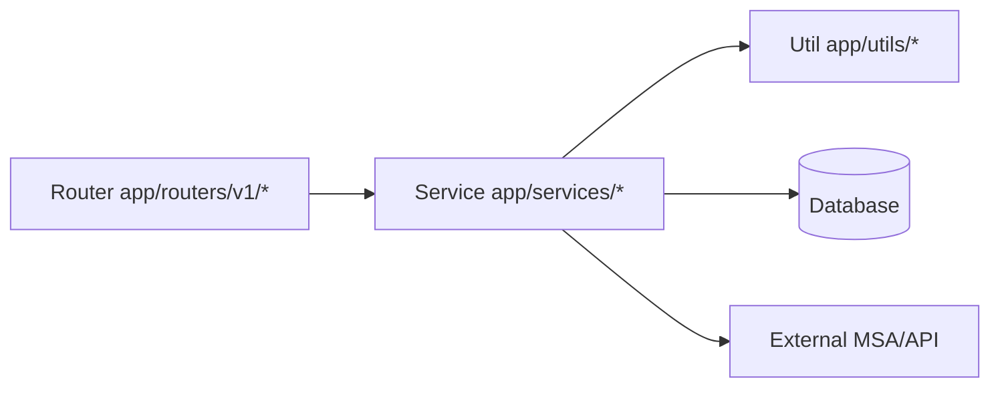

# Backend Quick Guide

This is a minimal quick-reference guide for backend contributors.
For full engineering rules, follow `src/backend/BACKEND.md`.
For backend test engineering rules, follow `src/backend/TEST.md`.

## 1) Core Rules

- Layering pattern: `Router -> Service -> Util/DB/MSA`
- Access environment variables through `SETTINGS` in `app/core/settings.py`
- If schema/models change, Alembic migration updates are required

## 1.1) Backend Flow



## 2) Setup

```bash
cd src/backend
uv sync
```

## 3) Run Server

```bash
cd src/backend
uv run uvicorn app.main:app --reload --port 8000
```

API docs:
- `http://localhost:8000/docs`

## 4) Lint / Format (Ruff)

```bash
cd src/backend
uv run ruff check . --fix
uv run ruff format .
```

Check-only mode:

```bash
cd src/backend
uv run ruff check .
uv run ruff format . --check
```

## 5) DB Migration (Alembic)

After model/schema changes:

```bash
cd src/backend
uv run alembic revision --autogenerate -m "describe-schema-change"
uv run alembic upgrade head
```

Rollback example:

```bash
cd src/backend
uv run alembic downgrade -1
```

## 6) Pre-Commit Checklist

```bash
cd src/backend
uv run ruff check . --fix
uv run ruff format .
```

Also verify:
- If DB changed, confirm Alembic revision/upgrade
- If behavior/rules changed, sync `AGENTS.md`, root `README.md`, and `src/backend/BACKEND.md`

## 7) Tests (Domain/API Structure)

- Tests are organized by API domain under `tests/api/v1/<domain>/`.
- Current starter layout:
1. `tests/api/v1/auth/test_auth_api.py`
2. `tests/api/v1/api_key/test_api_key_api.py`

Run tests:

```bash
cd src/backend
uv run pytest
```
