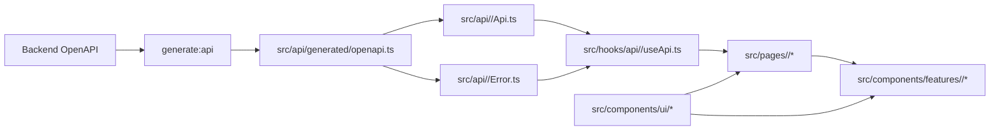

# Frontend Engineering Guide

This guide exists because the project is optimized for agentic coding patterns, and both agents and humans are expected to follow the same conventions to maintain highly consistent, high-quality outcomes.

## 0) Scope and Priority

- Scope: everything under `src/frontend`.
- Read order before frontend work:

1. Root `AGENTS.md`
2. This document (`src/frontend/FRONTEND.md`)
3. Test guide (`src/frontend/TEST.md`) when adding/changing tests

- Priority on conflicts:

1. Root `AGENTS.md`
2. This document
3. Local file comments and existing code style

## 0.1) Frontend Project Structure

```text
src/frontend/
  src/
    api/          # generated + domain API/error
    hooks/        # api hooks + app hooks
      realtime/   # stream subscription lifecycle hooks (non-API)
        core/     # shared stream lifecycle/reconnect hooks
        <domain>/ # domain-specific stream handlers (apiKey, ...)
    pages/        # page-group based (login/settings/main)
    components/
      ui/         # reusable UI components (category folders)
      features/   # domain-specific components
      layout/     # app shell/navigation
    styles/
    utils/
  scripts/
  public/
```

## 0.2) Frontend Flow and Coupling



## 1) Formatting and Linting

- Prettier is the formatting source of truth for frontend code.
- Required before commit (run in `src/frontend`):

1. `npm run format`
2. `npm run format:check`

- Keep formatting and import organization aligned with the frontend VS Code settings file if present.

## 2) TypeScript Rules (Strict)

- TypeScript is mandatory for all frontend code.
- `tsconfig.json` strict mode must remain enabled.
- Avoid `any` unless there is no safe alternative.
- Prefer precise domain types imported from generated OpenAPI schemas.
- Public utilities, hooks, and API wrappers should always declare explicit input/output types.

## 2.1) Type Declaration Convention

- Naming/approach used in this project:

1. Strict TypeScript
2. Explicit typing
3. Contract-first typing (generated OpenAPI types first)

- Declaration rules:

1. Prefer `type` aliases by default.
2. Use `interface` only when extension/implementation semantics are clearly required.
3. Props types must use `XxxProps` naming.
4. API-related local types must use clear suffixes such as `Request`, `Response`, `ErrorDetail`.
5. Keep domain-local types near the domain module; avoid broad global type dumping.
6. Do not introduce `any` without a concrete reason and fallback plan.

## 3) API Contract Rule (`generate:api`, Required)

- Backend OpenAPI is the source of truth for API contracts.
- Required generation source:

1. `http://localhost:8000/openapi.json`

- Required generated file:

1. `src/api/generated/openapi.ts`

- Rules:

1. Use generated types from `src/api/generated/openapi.ts` in API/hook/page layers.
2. Do not maintain duplicate handwritten contract types for OpenAPI-backed endpoints.
3. If backend API schema changes, run `npm run generate:api` before API call site edits.
4. `npm run build` is server-independent by default (no OpenAPI fetch during build).
5. Use `npm run build:sync` for optional API refresh + build.
6. Use `npm run build:strict` (or `npm run generate:api`) when strict OpenAPI refresh from backend is required.

## 4) Domain API/Error/Hook Rule (1:1:1, Required)

- Domain modules must be co-located under `src/api/<domain>/`.
- Each domain must include:

1. `<domain>Api.ts`
2. `<domain>Error.ts`
3. `src/hooks/api/<domain>/use<Domain>Api.ts`

- Examples:

1. Auth router domain -> `src/api/auth/authApi.ts` + `src/api/auth/authError.ts` + `src/hooks/api/auth/useAuthApi.ts`
2. API key router domain -> `src/api/apiKey/apiKeyApi.ts` + `src/api/apiKey/apiKeyError.ts` + `src/hooks/api/apiKey/useApiKeyApi.ts`
3. Events router domain -> `src/api/events/eventsApi.ts` + `src/api/events/eventsError.ts` + `src/hooks/api/events/useEventsApi.ts`

- When a new backend router/domain is added, frontend must add the same domain 1:1:1 set in the same work cycle.
- Do not place domain error parsing/mapping in `src/utils`; keep it inside each domain API folder.
- API interface chain is mandatory:

1. `generated_api_schema`
2. `api/<domain>`
3. `hooks/api/<domain>`
4. actual usage (`pages/components`)

- Realtime stream note:

1. If backend auth for stream requires bearer token, do not use native `EventSource` for authenticated streams.
2. Use `fetch` streaming in domain API layer so `Authorization` header can be sent.
3. Reconnect/backoff policy should be implemented in `src/hooks/realtime/core/*`.
4. Domain event parsing/dispatch logic should be implemented in `src/hooks/realtime/<domain>/*`.

- `pages/components` must not import from `src/api/*` directly; they must consume domain hooks only.
- API hooks must be placed under `src/hooks/api/<domain>/*`.
- Non-API hooks (state/session/theme/feature/auth-context) must stay outside `src/hooks/api/*`.
- Page and hook responsibility rule:

1. Domain hook invocation is owned by page layer.
2. Pages must be organized by concrete page groups (for example `pages/login`, `pages/settings`, `pages/main`).
3. Domain feature components should receive state/actions via props and should not call domain API hooks directly.
4. Components may use non-domain hooks (for example UI state/theme/i18n) when needed.

## 5) Error Code Handling Rule

- Error handling must be based on backend-defined error codes and generated schema types.
- Maintain exhaustive code-to-message mapping with `Record<ErrorCode, ...>` style patterns.
- When new backend error codes appear, frontend mapping must fail fast at compile time until explicitly handled.
- Normalize unknown/non-schema errors to a safe fallback message path, while preserving known code branches.

## 6) Component and Style Rule (Showcase-First)

- Reuse shared UI components first, then feature-level components, then page composition.
- Component directory responsibilities:

1. `src/components/ui/*`: low-level reusable primitives
2. `src/components/layout/*`: app shell/navigation/layout-level components
3. `src/components/features/<domain>/*`: domain-specific feature components

- Required component priority:

1. `src/components/ui/*`
2. `src/components/layout/*` when composition reuse is needed
3. `src/components/features/<domain>/*` for domain-bound compositions
4. `src/pages/*` (composition-focused, minimal raw markup)

- Before creating a new component:

1. Check whether an equivalent component already exists in shared UI.
2. Check whether it belongs to `ui` (reusable) or `features/<domain>` (domain-specific).
3. Create it as a component unit, not inline page markup.
4. If a new reusable UI component is added, register a usage example in `src/pages/main/ShowCasePage.tsx`.

- UI folder rule:

1. Place UI components under category folders by component nature (`buttons`, `cards`, `dropdowns`, `lists`, `inputs`, `switches`, `toggles`, etc.).
2. Keep `src/components/ui/index.ts` as the export entry and update it whenever UI files are added/moved.

- Style rules:

1. All frontend CSS must be managed in `src/styles/app.css`.
2. Do not add separate page/component CSS files unless a documented exception is approved.
3. Avoid one-off style duplication when a reusable class or component style can be extracted.
4. Scrollbars must follow the global rules in `src/styles/app.css` so every scrollable container keeps a consistent style.

## 7) Build and Runtime Notes

- Install dependencies:

1. `npm ci` (or `npm install` when lockfile update is intended)

- Local dev:

1. `npm run dev`

- Production build:

1. `npm run build`
2. `npm run build:sync` (optional backend OpenAPI refresh)
3. `npm run build:strict` (requires backend OpenAPI endpoint)

- The build pipeline includes copying frontend artifacts into backend static path through `scripts/copy-to-backend.mjs`.

## 8) Internationalization Rule (Required)

- All user-facing text must be managed through i18n keys.
- Do not hard-code display strings in pages/components/modals/buttons/messages.
- Add or update locale entries first (for example `src/locales/en.json`), then reference keys in UI.
- Exception: non-user-facing internal identifiers (for example API field names, enum values, route paths) can remain as literals.

## 9) Completion Checklist

1. TypeScript strict mode preserved and no unnecessary `any`
2. API types regenerated when backend contract changed
3. New backend domains include frontend domain pair (`<domain>Api.ts` + `<domain>Error.ts`)
4. Error code maps are exhaustive for added backend codes
5. Shared components reused before page-level raw markup
6. All user-visible text is i18n-key based
7. Prettier format and check completed (`npm run format`, `npm run format:check`)
8. Frontend automated tests completed (`npm run test`)
9. Type checking completed (`npx tsc --noEmit` or `npm run build`, where build includes `tsc`)
